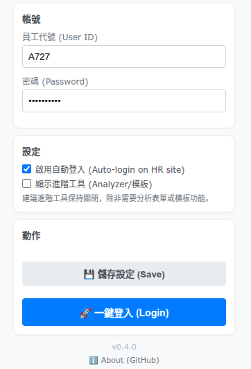
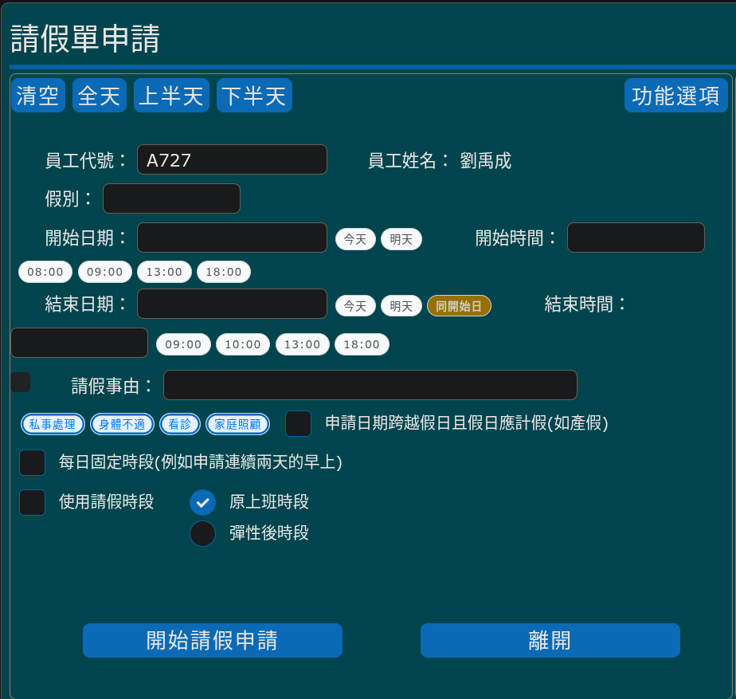
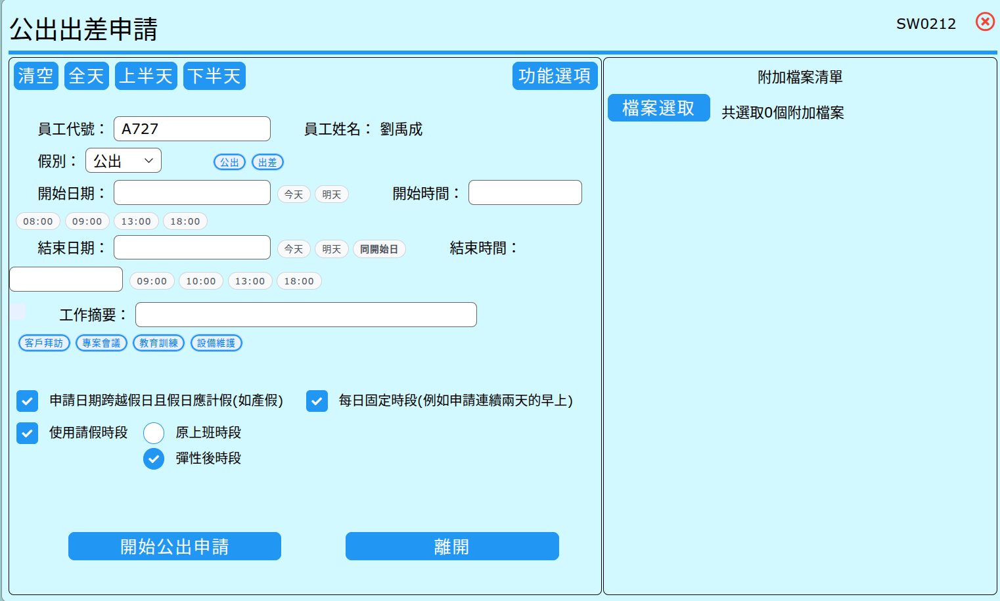

# Pesi HR 系統優化小幫手 (Pesi HR UI/UX Improver)

專為 **百一電子 (Pesi Electronics)** 同仁打造的 Chrome 擴充功能，讓請假、公出申請不再繁瑣，一鍵完成！

## 📸 實際畫面 (Screenshots)

| 快速登入 (Quick Login) | 請假申請 (Leave Application) | 公出申請 (Business Trip) |
|:---:|:---:|:---:|
|  |  |  |

---

## ✨ 為什麼你需要這個小幫手？

### 🔑 1. 一鍵登入，秒速開工 (New!)
*   在擴充功能選單中設定好帳號密碼。
*   以後只要按一下 **「一鍵登入」**，系統自動幫您開啟網頁並完成登入！

### 🚀 2. 一鍵帶入，告別手動輸入
不用再慢慢點選日曆或輸入時間！
*   **快速日期**：點擊「今天」、「明天」按鈕，日期直接帶入。
*   **常用時間**：內建 08:00、09:00、13:00、18:00 等按鈕，一鍵設定上下班時間。
*   **日期同步**：點選「同開始日」，結束日期自動同步，省去重複操作。

### 📝 3. 越用越聰明的「智慧標籤」
*   系統會自動記住您常輸入的 **「事由」** (如：看診、私事處理)。
*   下次填寫時，這些內容會變成 **「可點擊的標籤」**，按一下就填好，不用再打字！

### ⏱️ 4. 即時時數計算，避免算錯
*   當您調整日期或時間時，畫面會即時顯示 **「預計時數」** (例如：*1 天 4.5 小時*)。
*   送出前就能確認時數是否正確，減少被退件的機率。

### 🎨 5. 申請進度一目瞭然
*   歷史紀錄表格自動加上顏色標記，一眼就能看出簽核狀態：
    *   🟢 **綠色**：已核准 (Approved)
    *   🟡 **橘色**：簽核中 (Signing)
    *   🔴 **紅色**：被退回 (Rejected)

---

## 📥 安裝教學 (Installation)

1.  **下載檔案**：點擊本頁面的 `Code` > `Download ZIP` 並解壓縮。
2.  **開啟擴充功能頁面**：在 Chrome 網址列輸入 `chrome://extensions/`。
3.  **開啟開發者模式**：打開右上角的 **「開發者模式」** 開關。
4.  **載入**：點擊左上角的 **「載入未封裝項目」**，選擇剛剛解壓縮的 `extension` 資料夾。
5.  **完成**：現在登入 HR 系統，您就會看到不一樣的介面囉！

---

## 🔒 隱私權與安全 (Privacy)
*   **資料安全**：本程式 **不會** 將您的任何資料傳送到外部伺服器。
*   **帳號密碼**：您的帳號密碼僅儲存在您電腦的 Chrome 本地儲存區 (Local Storage)，僅用於自動登入功能，絕不外流。
*   **本地儲存**：您的常用事由僅儲存在您自己的瀏覽器中 (`localStorage`)。
*   **開源透明**：本專案為開源軟體，程式碼完全公開透明。

---

## 🛠️ 技術資訊 (For Developers)
*   **Target System**: Pesi HR Workflow System (Legacy ASP.NET)
*   **Tech Stack**: Vanilla JavaScript, CSS3
*   **Core Logic**: DOM Manipulation, MutationObserver (Disabled in v0.3.11+ for stability)

