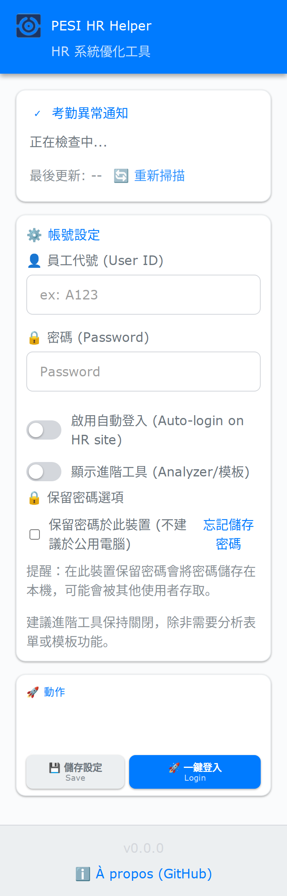
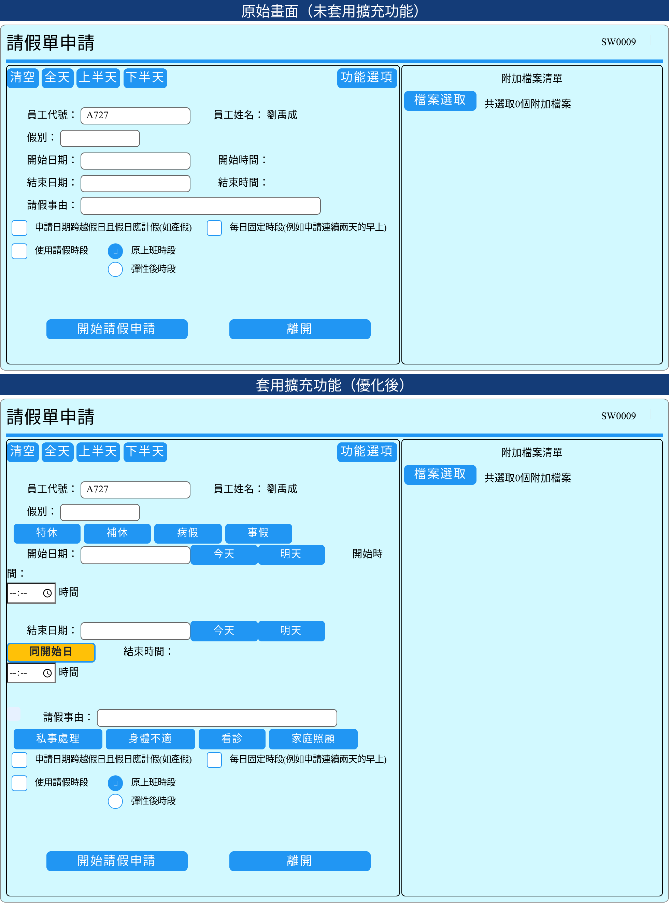
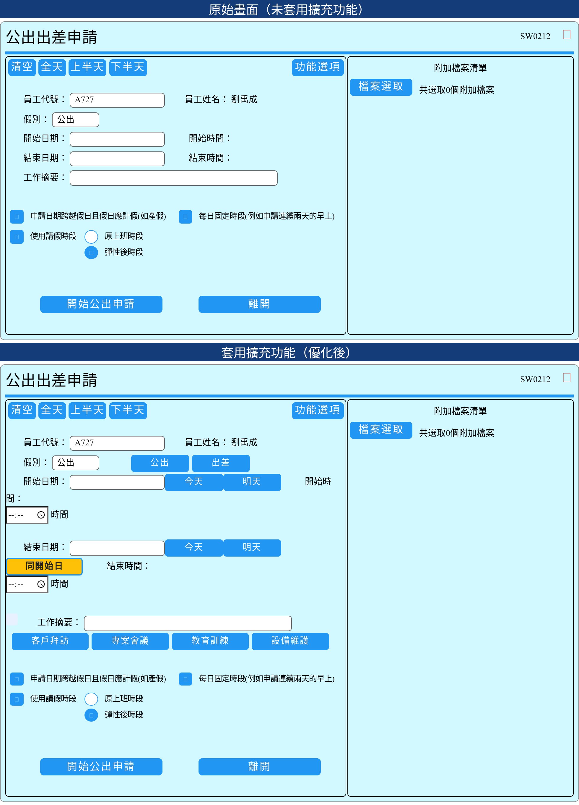

  

  # PESI HR UI/UX Improver
  
  **專為百一電子 (PESI Electronics) 同仁打造的 HR 系統優化工具**
  
  讓請假、公出申請不再繁瑣，一鍵完成！

  [功能介紹](#-核心功能-features) • [安裝教學](#-安裝教學-installation) • [隱私聲明](#-隱私權與安全-privacy)

 

## 📸 實際畫面 (Screenshots)

| 快速登入與異常通知 (Login & Alerts) | 請假申請 (Leave Application) | 公出申請 (Business Trip) |
|:---:|:---:|:---:|
|  |  |  |

<!-- MD3 time picker and smart-chips screenshots removed per request -->

---

## ✨ 核心功能 (Features)

### 🔑 1. 一鍵登入，秒速開工 (New!)
*   **自動記憶**：在擴充功能選單中設定好帳號密碼 (僅儲存於本地)。
*   **一鍵直達**：按一下 **「一鍵登入」**，系統自動開啟網頁、填寫帳密並登入，省去每天重複輸入的麻煩。

### 🚀 2. 智慧填寫，告別手動
*   **快速日期**：提供「今天」、「明天」按鈕，一鍵帶入日期。
*   **Material Design 3 時間選擇器**：我們已將舊有的多個時間按鈕替換為現代化的 MD3-styled 時間輸入欄位（HTML5 `type="time"`），可用下列方式設定時間：
    - **點選時鐘圖示或欄位**：在欄位右側會有小時鐘圖示（或瀏覽器顯示的下拉箭頭），點選會開啟原生時間挑選器（建議使用）。
    - **直接輸入**：也可在欄位內直接輸入 `HH:MM`（例如 `14:30`），按 Enter 或點擊欄位以外區域套用。
    - **鍵盤操作**：在 picker 開啟時可使用上下左右鍵或 Tab 鍵來切換並確認數值。
    - **行動裝置**：在手機/平板上會呈現滾輪式或系統原生時間選擇器，觸控體驗最佳。
    這樣做的好處是：畫面更簡潔、可輸入任意分鐘數（非只限預設值），且使用者得以利用瀏覽器/系統的最佳化時間控件。
*   **日期同步**：點選「同開始日」，結束日期自動同步，避免手殘選錯月份。

### 📝 3. 越用越聰明的「智慧標籤」
*   **自動學習**：系統會自動記住您常輸入的 **「事由」** (如：看診、私事處理)。
*   **快速假別**：請假單新增 **「假別」** 快速按鈕 (如：特休、事假、病假)，點擊即選中，支援連動系統更新。
*   **一鍵帶入**：下次填寫時，這些內容會變成 **「可點擊的標籤」**，按一下就填好，不用再打字！
*   **修正完成**：已修復請假類型自動填入功能，現在正確設定系統所需的 ID 值而非顯示名稱。

### ⏱️ 4. 即時時數計算
*   **即時預覽**：調整日期或時間時，畫面即時顯示 **「預計時數」** (例如：*1 天 4.5 小時*)。
*   **防呆機制**：送出前就能確認時數是否正確，減少被 HR 退件的機率。

### 🎨 5. 視覺化進度追蹤
*   歷史紀錄表格自動加上顏色標記，一眼就能看出簽核狀態：
    *   🟢 **綠色**：已核准 (Approved)
    *   🟡 **橘色**：簽核中 (Signing)
    *   🔴 **紅色**：被退回 (Rejected)

### 🔔 6. 考勤異常通知 (New!)
*   **自動偵測**：開啟擴充功能時，自動掃描當前頁面是否有 **「遲到」、「早退」、「未刷卡」、「缺勤」或「加班」** 等異常紀錄。
*   **即時提醒**：在面板上直接顯示異常筆數與日期，不用在一行行檢查表格，確保考勤無誤。

---

## 📥 安裝教學 (Installation)

1.  **下載檔案**：
    *   點擊本頁面的 `Code` > `Download ZIP` 並解壓縮。
2.  **開啟擴充功能頁面**：
    *   在 Chrome 網址列輸入 `chrome://extensions/` 並按下 Enter。
3.  **開啟開發者模式**：
    *   打開右上角的 **「開發者模式 (Developer mode)」** 開關。
4.  **載入擴充功能**：
    *   點擊左上角的 **「載入未封裝項目 (Load unpacked)」**。
    *   選擇剛剛解壓縮的 `extension` 資料夾。
5.  **開始使用**：
    *   現在登入 HR 系統，您就會看到不一樣的介面囉！建議將擴充功能釘選在瀏覽器右上角以便使用「一鍵登入」。

---

## 🔒 隱私權與安全 (Privacy)

我們非常重視您的隱私與資訊安全：

*   🛡️ **資料不外流**：本程式 **完全離線運作**，不會將您的任何資料傳送到外部伺服器。
*   🔑 **帳號安全**：您的帳號密碼僅儲存在您電腦的 Chrome **本地儲存區 (Local Storage)**，僅用於自動登入功能。
*   💾 **本地紀錄**：您的常用事由僅儲存在您自己的瀏覽器中。
*   📖 **開源透明**：本專案為開源軟體，程式碼完全公開透明，歡迎檢視。

---

## 🛠️ 技術資訊 (For Developers)

*   **Target System**: PESI HR Workflow System (Legacy ASP.NET)
*   **Tech Stack**: Vanilla JavaScript (ES6+), CSS3, Chrome Extension Manifest V3
*   **Core Logic**: DOM Manipulation, MutationObserver
*   **Compatibility**: Google Chrome, Microsoft Edge
*   **Latest Version**: 0.3.26
*   **Recent Updates**: 
    *   Material Design 3 time picker implementation
    *   Fixed leave type auto-filler with correct ID mappings
    *   Improved user experience with modern UI components

